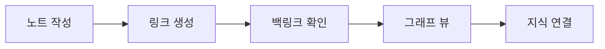

# 옵시디언 강좌 스크린샷 전략

## 🎯 현재 상황
- Termux 환경에서는 직접적인 GUI 스크린샷 캡처 불가
- 옵시디언은 데스크톱 애플리케이션이므로 실제 화면 필요

## 📸 스크린샷 대안 전략

### 1. **SVG/CSS 기반 모의 UI 생성**
```python
def create_mock_obsidian_ui(element_type):
    """옵시디언 UI를 모방한 SVG/HTML 생성"""
    if element_type == "vault_selector":
        return """
        <div class="obsidian-mock-ui">
            <div class="vault-selector">
                <h3>Open vault</h3>
                <button class="vault-item">📁 My Notes</button>
                <button class="vault-item">📁 Work Vault</button>
                <button class="create-vault">+ Create new vault</button>
            </div>
        </div>
        """
```

### 2. **공식 문서 이미지 활용**
- Obsidian 공식 문서의 이미지 URL 수집
- 라이선스 확인 후 적절히 활용
- 출처 명시

### 3. **ASCII 아트 다이어그램**
```
┌─────────────────────────────────────┐
│ 📁 File Explorer    🔍 Search       │
├─────────────────────────────────────┤
│ 📂 Folders                          │
│  └── 📄 Daily Notes                 │
│      ├── 2025-06-29.md             │
│      └── 2025-06-28.md             │
│  └── 📁 Projects                    │
│      └── 📄 Obsidian Course.md     │
└─────────────────────────────────────┘
```

### 4. **Mermaid 다이어그램**


### 5. **플레이스홀더 이미지 시스템**
```html
<div class="screenshot-placeholder">
    <div class="placeholder-content">
        <i class="fas fa-image"></i>
        <p>옵시디언 볼트 생성 화면</p>
        <small>실제 스크린샷은 추후 업데이트 예정</small>
    </div>
</div>
```

## 🚀 구현 계획

### Phase 1: 텍스트 기반 강좌 (즉시 가능)
- 상세한 텍스트 설명
- ASCII 다이어그램
- 코드 예제

### Phase 2: 모의 UI (1주일)
- HTML/CSS로 옵시디언 UI 재현
- 인터랙티브 요소 추가
- 애니메이션 효과

### Phase 3: 실제 스크린샷 (추후)
- 데스크톱 환경에서 캡처
- 커뮤니티 기여 받기
- 자동화 시스템 구축

## 💡 즉시 실행 가능한 방안

1. **HTML/CSS 모의 UI 생성기**
```python
class ObsidianUIGenerator:
    def __init__(self):
        self.components = {
            'sidebar': self.create_sidebar,
            'editor': self.create_editor,
            'graph': self.create_graph_view
        }
    
    def create_sidebar(self):
        # 사이드바 HTML 생성
        pass
    
    def create_editor(self):
        # 에디터 뷰 생성
        pass
```

2. **강좌별 필요 스크린샷 목록**
- Lesson 01: 설치 화면, 첫 실행 화면
- Lesson 02: 볼트 생성, 폴더 구조
- Lesson 03: 마크다운 에디터
- ...

3. **대체 콘텐츠 우선순위**
- 핵심 기능은 모의 UI로
- 복잡한 기능은 다이어그램으로
- 설정 화면은 텍스트 설명으로

## 📝 결론
스크린샷 없이도 효과적인 강좌 제작 가능:
1. 텍스트 + 코드 예제 중심
2. 모의 UI로 시각적 이해 도움
3. 추후 실제 스크린샷으로 교체 가능한 구조